# 🛍 Customer Analytics & Sales Forecasting — Urban Threads

## 📌 Introduction

Urban Threads is a fictional mid-size retail store specializing in fashion and accessories, both in-store and online.

The goal of this project was to analyze customer behavior, product performance, and sales trends, while applying advanced analytics techniques such as clustering, association rules, cohort analysis, and forecasting.

Although the dataset is entirely synthetic, it has been designed to replicate realistic business scenarios, allowing me to showcase end-to-end data analysis and business intelligence skills.

## 🔍 Project Overview

The analysis covers multiple aspects of retail business intelligence:

Customer Segmentation (RFM Analysis + K-Means Clustering)

Customer Retention & Cohort Analysis

Sales Forecasting using Prophet

Association Rules Mining

Customer Lifetime Value Prediction

Product Return Rates & Estimated Loss

Revenue Trends Analysis

Price Elasticity Analysis

Anomaly Detection in Daily Sales

Category-Level Sales Heatmap

# 📊 Visualizations & Insights

## 1️⃣ K-Means Clustering (RFM Segmentation)

A 3D scatter plot using Recency (X-axis), Frequency (Y-axis), and Monetary value (Z-axis).

Five distinct customer segments are identified with different colors, for example:

High spenders

Recent but low-frequency buyers

Recent and high-frequency buyers

At-risk customers (last purchase was long ago)

Lost customers (low frequency and very old purchase date)

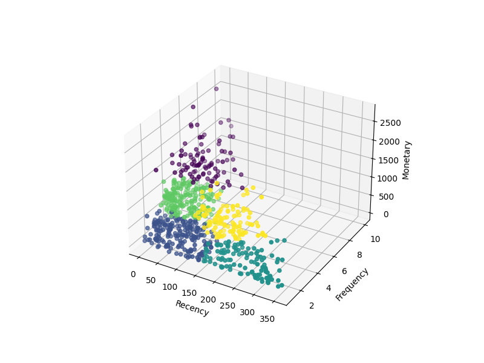

## 2️⃣ Customer Retention by Cohort

A cohort retention chart showing customer return rates from August 2024 to August 2025.

The heatmap clearly illustrates that most customers return within the first two months, with retention rates gradually declining over time.
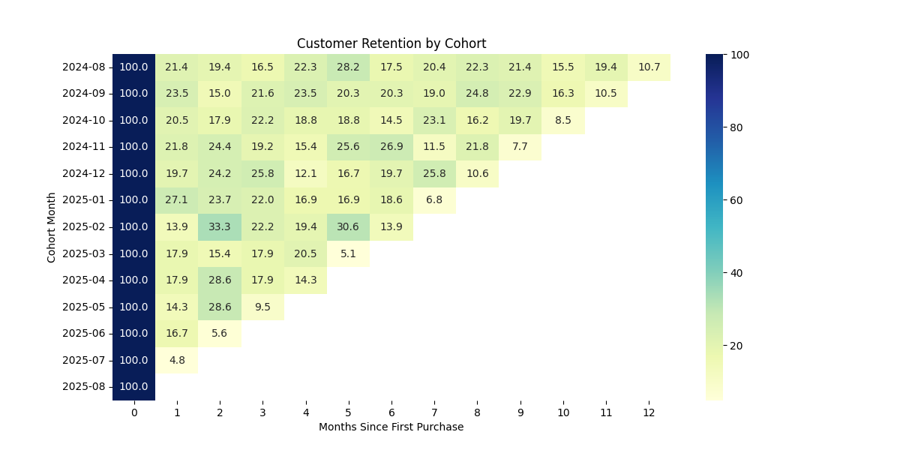

## 3️⃣ Sales Forecast with Prophet

Graph 1:

A time series chart of daily sales with Prophet’s forecast line and confidence intervals, predicting trends up to November 2025.

The forecast suggests stable sales levels in the near future.

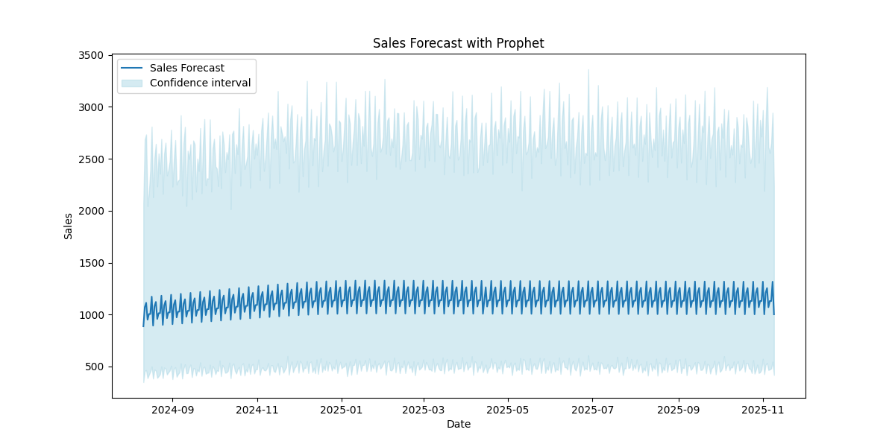

Graph 2:

Top chart: Monthly sales trends showing growth from early 2025, followed by a slight stabilization.

Bottom chart: Weekly sales distribution — highest sales occur on Saturdays, lowest on Sundays.

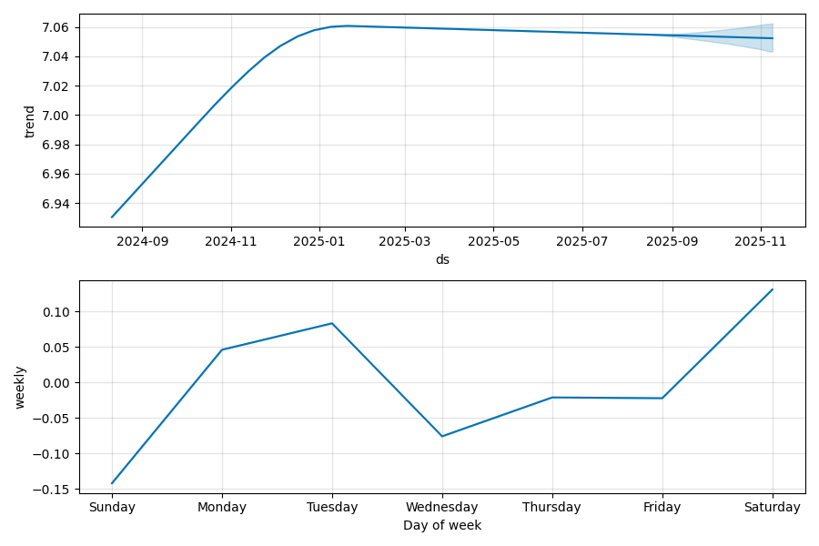

## 4️⃣ Association Rules — Support vs Confidence (Lift as Size/Color)

A scatter plot with:

X-axis: Support

Y-axis: Confidence

Point size & color: Lift

Key findings:

Product #58 (Accessories) is strongly associated with Product #47 (Accessories) — possibly earrings purchased together with necklaces.

Product #16 (Footwear) is often bought together with Product #48 (Clothing) — likely shoes paired with dresses.

Other associations can be found in the Excel file (Products sheet) with product IDs and descriptions.

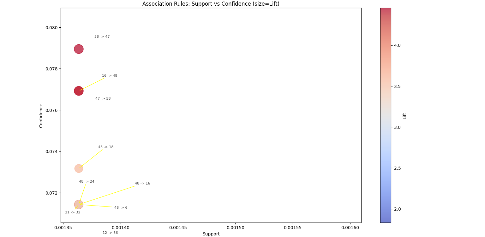

## 5️⃣ Customer Lifetime Value (CLV) Prediction

A table listing the top 10 customers with the highest predicted CLV over the next 90 days, including:

Predicted Monetary Value

Predicted Purchases

Acquisition Channel

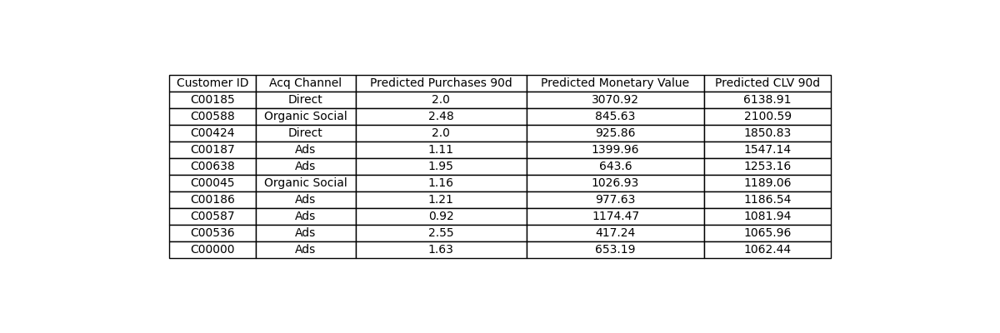

## 6️⃣ Product Return Rate

A bar chart showing refund rates per product.

Highest return rate: Product #43 (Footwear).

Full product mapping is available in the Excel file.

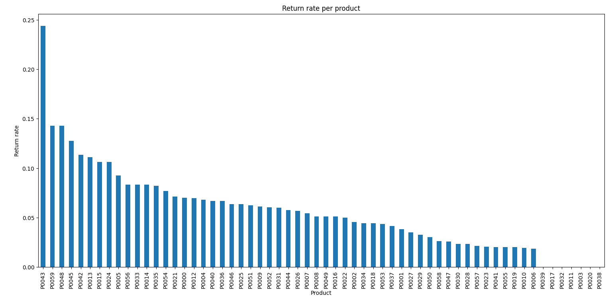

## 7️⃣ Estimated Loss per Product

A similar bar chart estimating revenue losses caused by product returns.

Highest loss: Product #43 (Footwear).

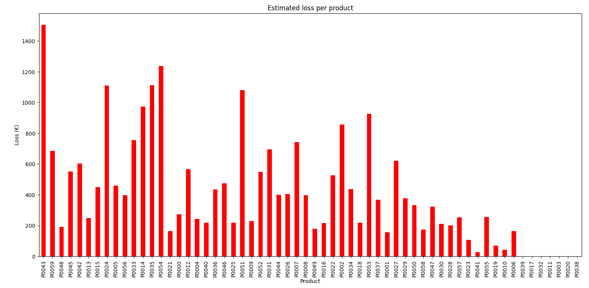

## 8️⃣ Average CLV by Acquisition Channel

Predicted average CLV for each acquisition channel over the next 90 days.

Highest CLV: In-store purchases

Lowest CLV: Email campaigns

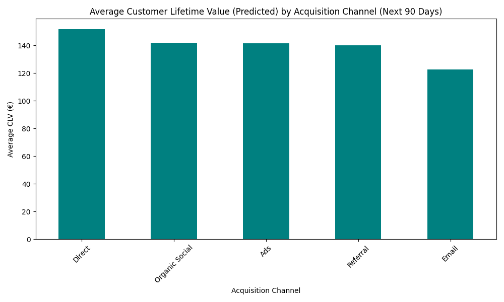

## 9️⃣ Monthly Sales Revenue Over Time

A line chart showing monthly revenue:

Lowest points: Store opening month and August 2025 (partial month).

Highest month: May 2025

Surprisingly low month after peak: June 2025.

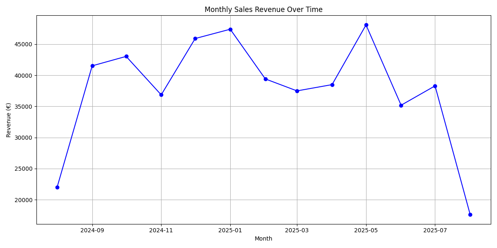

## 🔟 Price Elasticity of Demand (Log-Log Regression)

A scatter plot and regression line showing the relationship between price and quantity sold.

Interestingly, the trend suggests that higher prices were associated with slightly higher quantities — likely an artifact of the synthetic dataset.

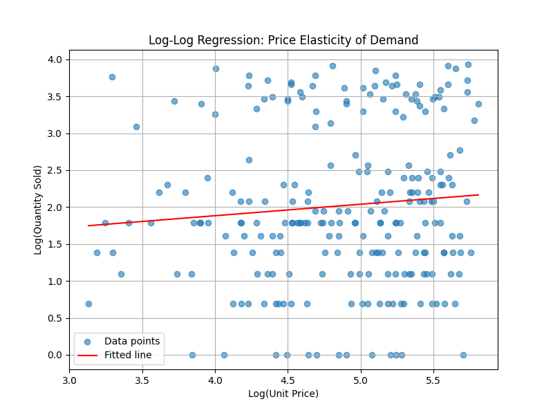

## 1️⃣1️⃣ Daily Sales with Anomaly Detection

A time series of daily revenue with anomalies highlighted in red, marking unusual sales peaks and dips.

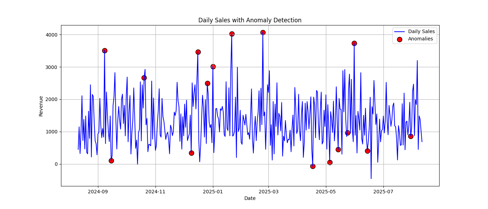

## 1️⃣2️⃣ Sales Heatmap by Category & Month

A heatmap of product categories over time:

Footwear: High sales in December 2024

Accessories: Peaks in September 2024 and May 2025

Lowest-selling categories: T-shirts and Jeans

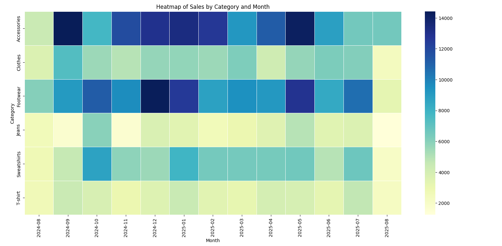

# 🛠 Tools & Technologies
- Python (pandas, numpy, matplotlib, seaborn, scikit-learn, prophet, mlxtend)
- Excel
- Power BI
- SQL

